# Welcome to my Gamewise Blog Project Portfolio 4. Created using the django blog provided by CODE INSTITUTE.

* Here is a live link to my blog https://gamewise-blog.herokuapp.com/

* Here is a link to the github repository https://github.com/gareth-39/Gamewise-Blog
  

#

# Table of Contents:
* Libraries used
* Purpose
* My Blog
* UX/UI
* Site goals
* Requirements
* Design
* Functionality
* Testing
* Code validator
* Javascript results (Jshint)
* Lighthouse results
* CSS results (CI python linter)
* HTML results (w3c validator)
* Am i responsive
* Wireframes
* User stories
* Future features
* Bugs and errors
* Deployment
* Credits
* Icons
* Fonts
* Programs used
* My thanks  

#

# Libraries and technologies used:
- Django
- Crispy forms
- Cloudinary
- Bootstrap
- Python
- Elephant Sql
- Heroku

# Purpose:
The intension of my Gamewise-blog was to demonstrate the skills I have acquired during this phase of the full stack development course. The blog was developed to illustrate my proficiency in building a fully functional Django blog with interactive features, catering for both the administrative and user perspectives.

#

# My blog:
The creation of my Gamewise-blog was propelled by the intention of facilitating the collaborative convergence of mental health and gaming. This aimed to establish a protected and all-inclusive environment where cohorts could meet and communicate freely concerning their personal experiences with mental health.  Through the integration of these two distinct domains, the blog sought to create a platform which encourages open dialogue, fosters a sense of safety, and demonstrates that a sense of comfort can be found in the most unlikely places. 

#

# Features of my blog
- Here is a selection of screenshots which illustrates  the diverse mechanisms imbedded within my blog.
  

#

# UX/UI
The blog was created to show my programming knowledge of Django, Html, User stories,  Issues Agile development, Python testing and Api's.

#

# Requirements 
- Corresponds to all screen sizes and devices.
- Accessible and user friendly blog.
- User friendly and clear navigation methods.

#

# Expectations 
- Every part of my blog is functional as intended.
- Each  button is functional and corresponded accordingly when pressed.
- Responsive on all devices irrespective of users choice.
- All functions worked as they should and in a clear and concise manner.

#

# Design:
My intension was to formulate a blog which encompassed simplicity and visual comfort. Each component was carefully constructed to foster readability and clarity. The user interface provided a straightforward concept for creating, editing, and adapting changes effortlessly. Furthermore, it was designed so users could easily read, like and communicate with other users’ posts. I optimised visual perception through the use of black text accompanied by red boxes, which enhances the viewing experience. 

#

# Functionality
* All buttons and links have been hovered over and clicked on to ensure accessibility.
* All pages load correctly across all device screen sizes (Please see testing section).
* Functional buttons worked as intended and on different device screen sizes.

#
#

# Testing:
## Lighthouse test:
* This is the lighthouse testing for my blog on all three pages used Homepage, Register and Login 

#
## Html W3C Validator:
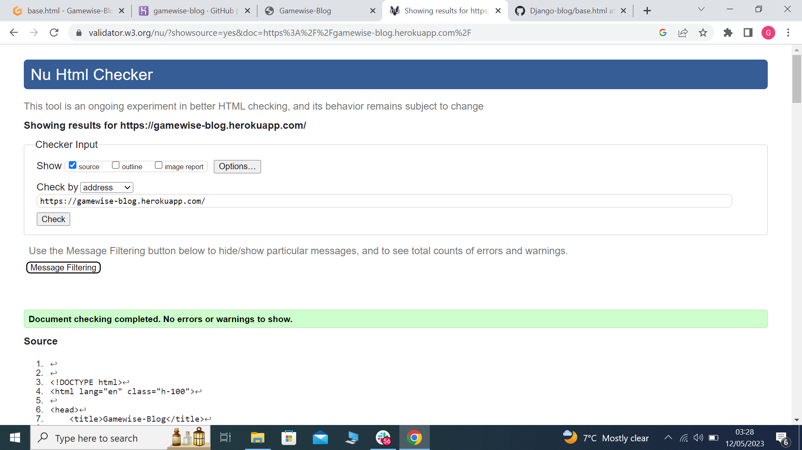

#
## Css W3C Validator:
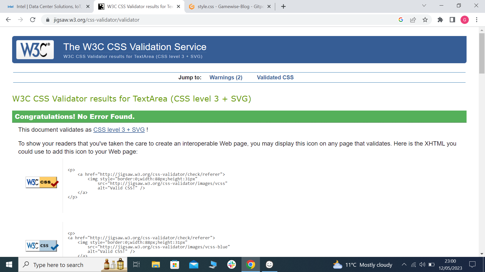

#
## Javascript (jshint)
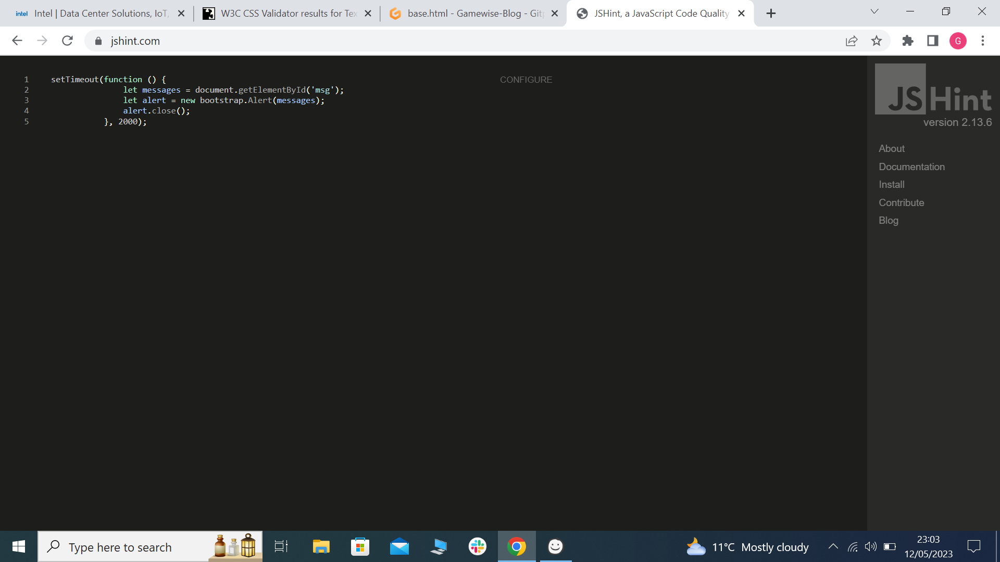

#
## CI Python Linter:
* This covers all my py files in my gamewise blog folder.
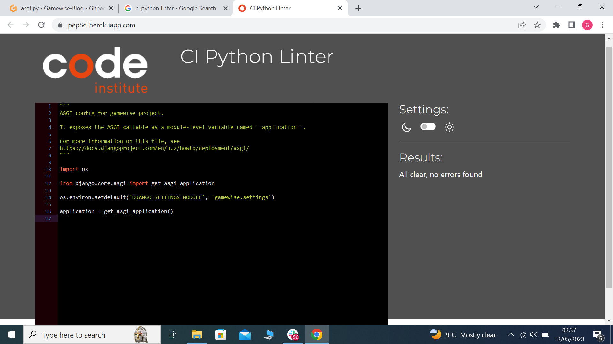
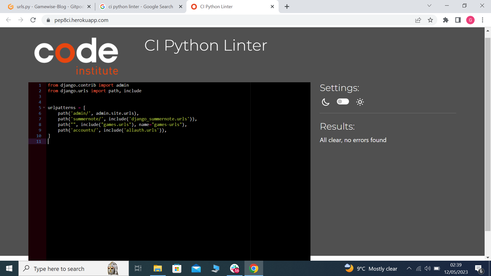
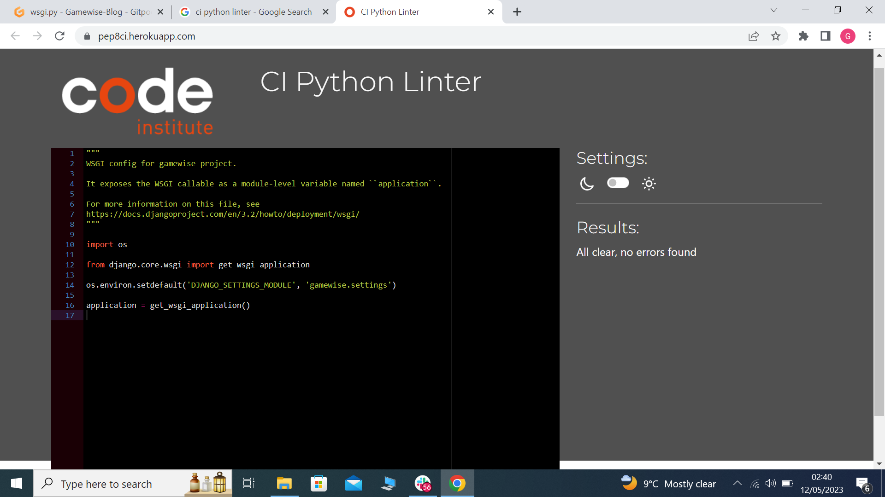
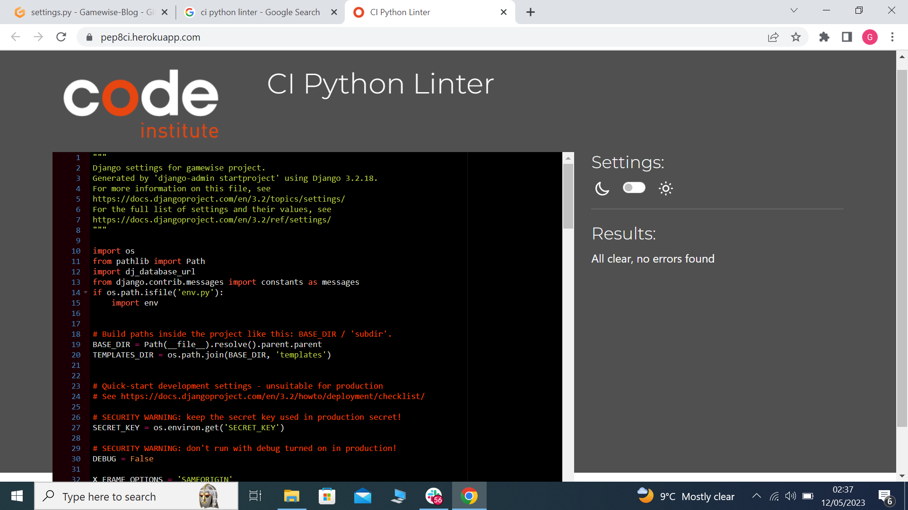

* This covers all my py files in my games folder.
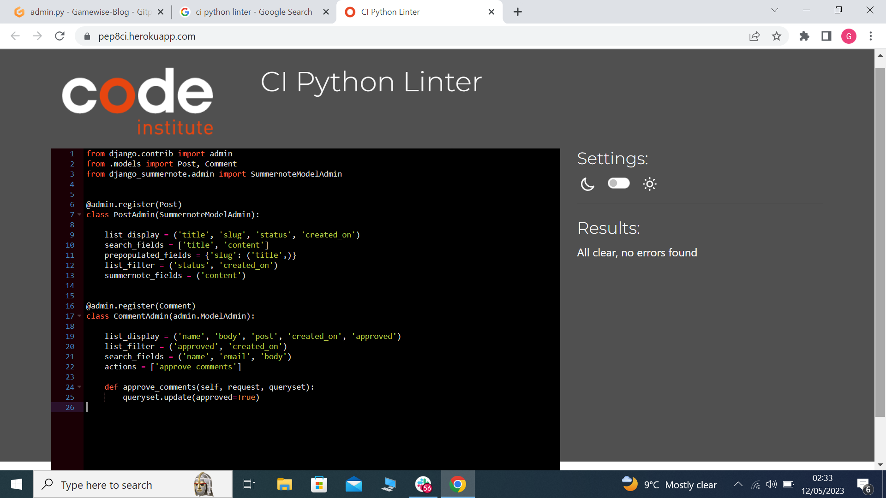
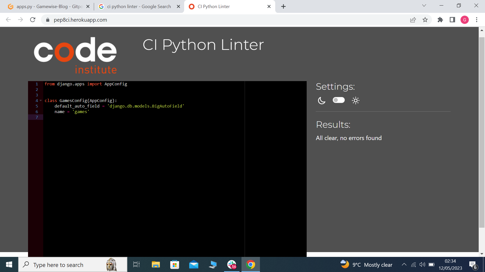
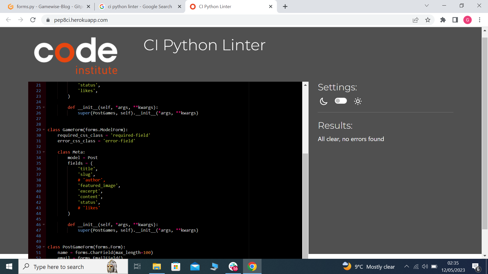
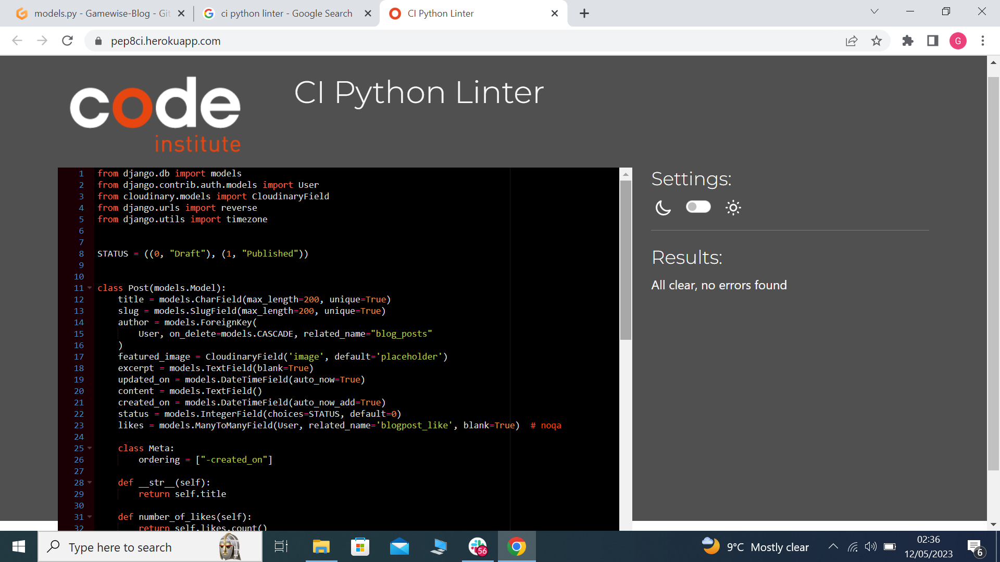
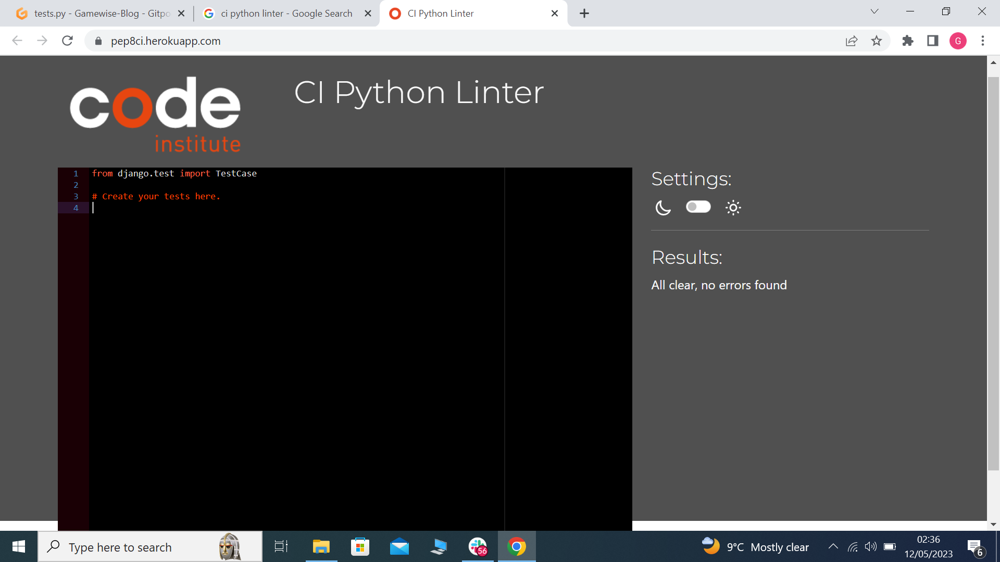
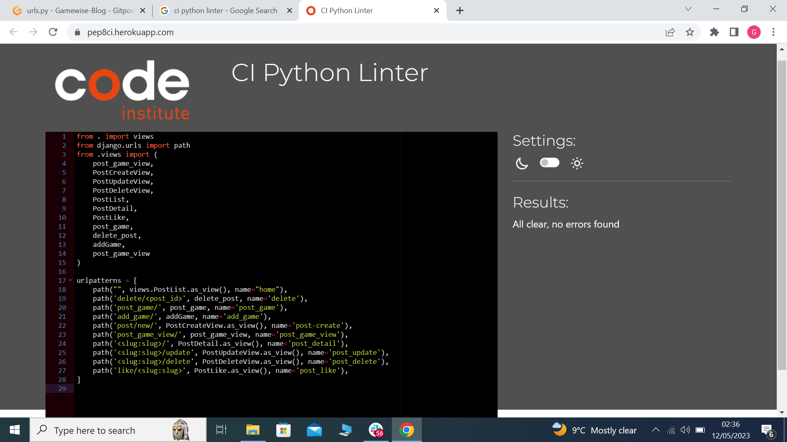
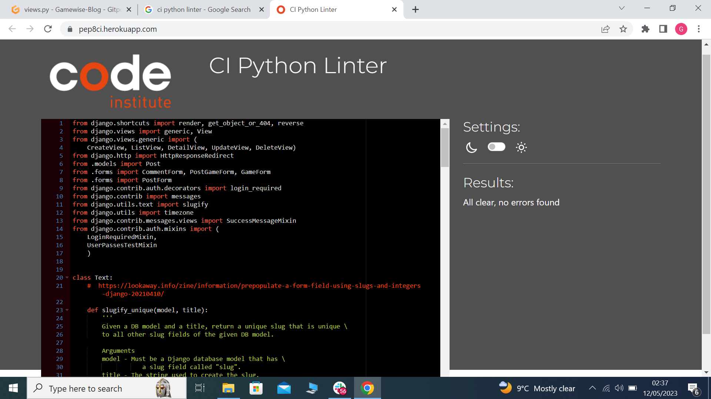
- All came back clear of any faults

#
## I am responsive:

#
# Wireframes:
- i used https://balsamiq.com/wireframes/ to design my wireframes.  

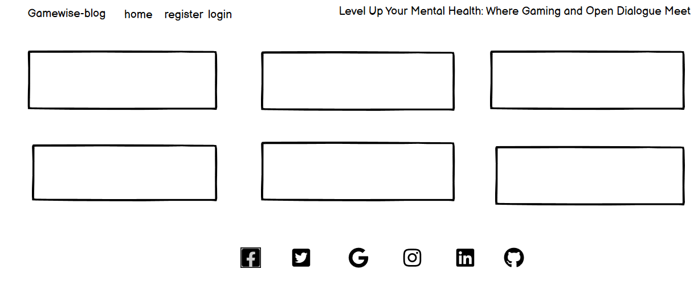

#

# User stories:
- This is my user story screenshot  
  

- This is my open issues screenshot  
  

- This is my closed issues screenshot  
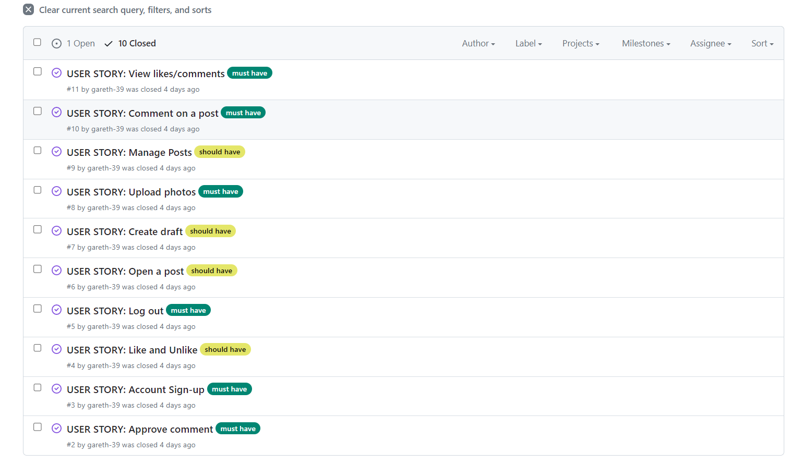

#

# Future features:
* In the future i would like to add "social sign-in   and a "forgot my password reset link".  

* Here is a link to my issues page on github https://github.com/gareth-39/Gamewise-Blog/issues

#

# Bugs and errors:
I had so many bugs and errors on this project, here is a list of them and the solutions i encorperated.

- Error 404 page not found = (Solution) It was I had not linked my paths properly in my settings.py

- CSS not working on Heroku = (Solution) I had not changed debug to false before deployment

- Server 500 = (Solution) there was a problem in my json file with the superuser deleted that user and replaced it with a new one.

- html pages not found = (Solution) This was a big one as it made my whole code error i changed a file name from blog to games, i didnt realise every where on the code i needed to change blog to games in each py file.

- Images not loading = (Solution) Realised it was the I was using it didnt seem to be compatible with gitpod so all the images errored changed the site and they worked perfectly.

- Build fail on heroku = (Solution) When I deployed through heroku the build failed not sure why just disconnected the app and re-deployed and it worked.

- Indentation errors = (Solution) Simple spelling mistakes that were easily fixed.

- Fields.E305 error = (Solution) Screenshot provided  This one took a lot to figure out I realised the name on the related path was to similar. So i replaced the names with a universal + sign and it fixed the error.

#

#  Deployment
* This project was deployment using Code institute's mock terminal on Heroku.

* * Sign up for heroku.
* * Create a Heroku app.
* * Add a confrig var (key) PORT (value) 8000.
* * CLOUDINARY_URL
* * DATABASE_URL
* * HEROKU_POSTGRESQL_GREEN_URL
* * SECRET_KEY
* * Link the Heroku app to my repository.
* * Build the repository.
* * Click on deploy.
* * New page opens with working app.

#

# Credits:

* Bootstrap https://getbootstrap.com/

* Code Institute https://codeinstitute.net/ie/

* Pexel.com https://www.pexels.com/ for all my images

* Slack https://app.slack.com/

* Google http://google.com/

* Student care https://learn.codeinstitute.net/ci_support/diplomainsoftwaredevelopmentecomm/studentcare
without them i would have given up.

#

# Icons:

* Font awesome https://fontawesome.com/

#

# Fonts:

* Google fonts https://fonts.google.com/

#

# Programs used:

* HTML 59.1%
* Python 38.0%
* Css 2.9%

#

# My thanks:

* Thanks to my mentor Jubril Akolade for his endless patience and answering my plethora of questions.

* Thanks to Google (https://www.google.com/) for helping me debug and troubleshoot any issue I had.

* Thanks to Code Institute https://codeinstitute.net/ie/ once again for creating the template for this blog.

* Finally, thanks to my Slack group (https://app.slack.com/) who are so helpful and assisting me every step of the way.